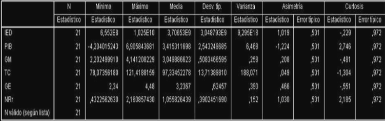
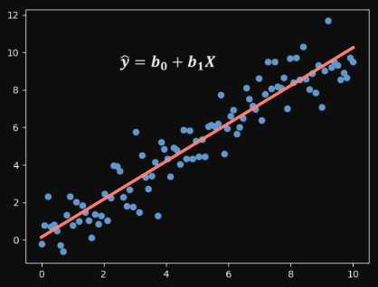

\begin{center}
  \includegraphics[width=6cm]{Imagenes_informe/LOGO-UFT-WEB.png}
     \vspace{2 cm}

  \normalsize \author{Gianfranco Astorga, Jean Lucas Peñaloza, Diego Godoy}
  \vspace{2 cm}

  \normalsize \date{3 de noviembre de 2023}
  \vspace{2 cm}

\end{center}

\newpage

# Indice

- [Introducción](#introducción)
- [Objetivos](#objetivos)
  - [Objetivo General](#objetivo-general)
  - [Objetivos Específicos](#objetivos-específicos)
- [Trabajo Previo](#trabajo-previo)
- [Marco Teórico](#marco-teórico)
  - [Regresión Lineal](#regresión-lineal)
  - [Correlación Lineal de Pearson](#correlación-lineal-de-pearson)
- [Desarrollo](#desarrollo)
  - [Análisis Exploratorio de Datos](#análisis-exploratorio-de-datos)
    - [Carga de Datos](#carga-de-datos)
    - [Visualización de Datos](#visualización-de-datos)
    - [Análisis de Datos](#análisis-de-datos)
    - [Estadística Descriptiva](#estadística-descriptiva)
    - [Gráficos de caja y de dispersión](#gráficos-de-caja-y-de-dispersión)
    - [Correlación](#correlación)
  - [Investigación de modelo de regresión lineal](#investigación-de-modelo-de-regresión-lineal)
  - [Correlación lineal de Pearson](#correlación-lineal-de-pearson)
  - [Gráfico de dispersión](#gráfico-de-dispersión)
    - [Calidad percibida vs Agilidad en la entrega del servicio](#calidad-percibida-vs-agilidad-en-la-entrega-del-servicio)
    - [Calidad percibida vs Flexibilidad de pago](#calidad-percibida-vs-flexibilidad-de-pago)
    - [Calidad percibida vs Atención del personal](#calidad-percibida-vs-atención-del-personal)
  - [Modelo de regresión lineal "Calidad percibida vs Agilidad en la entrega del servicio"](#modelo-de-regresión-lineal-calidad-percibida-vs-agilidad-en-la-entrega-del-servicio)
  - [Coeficientes del modelo](#coeficientes-del-modelo)
    - [Interpretación de los coeficientes del modelo](#interpretación-de-los-coeficientes-del-modelo)
    - [Interpretación del coeficiente de determinación](#interpretación-del-coeficiente-de-determinación)
    - [Interpretación del valor p del coeficiente de regresión](#interpretación-del-valor-p-del-coeficiente-de-regresión)
  - [Investigación ANOVA modelo de regresión lineal](#investigación-anova-modelo-de-regresión-lineal)
    - [Interpretación de la tabla ANOVA](#interpretación-de-la-tabla-anova)
  - [Test de hipótesis para el coeficiente de regresión](#test-de-hipótesis-para-el-coeficiente-de-regresión)
    - [Interpretación del valor p del coeficiente de regresión](#interpretación-del-valor-p-del-coeficiente-de-regresión)
  - [Supuestos de normalidad y homocedasticidad](#supuestos-de-normalidad-y-homocedasticidad)
    - [Interpretación del test de normalidad](#interpretación-del-test-de-normalidad)
    - [Interpretación del test de homocedasticidad](#interpretación-del-test-de-homocedasticidad)
  - [Variable dummy](#variable-dummy)
    - [Interpretación de los coeficientes del modelo](#interpretación-de-los-coeficientes-del-modelo)
    - [Interpretación del coeficiente de determinación](#interpretación-del-coeficiente-de-determinación)
    - [Interpretación del valor p del coeficiente de regresión](#interpretación-del-valor-p-del-coeficiente-de-regresión)
  - [Modelo de regresión lineal "Calidad percibida vs Experiencia del personal"](#modelo-de-regresión-lineal-calidad-percibida-vs-experiencia-del-personal)
    - [Interpretación de los coeficientes del modelo](#interpretación-de-los-coeficientes-del-modelo)
    - [Interpretación del coeficiente de determinación](#interpretación-del-coeficiente-de-determinación)
    - [Interpretación del valor p del coeficiente de regresión](#interpretación-del-valor-p-del-coeficiente-de-regresión) 
- [Conclusiones](#conclusiones)
- [Bibliografía](#bibliografía)

\newpage

# 1. Introducción

El análisis de regresión lineal se ha utilizado ampliamente en diversos campos para estudiar la relación entre variables. El término "regresión" fue acuñado por Sir Francis Galton, quien lo empleó para describir los resultados de sus experimentos con arvejas. 
El contexto de este informe es el ámbito empresarial, específicamente en relación a la calidad del servicio al cliente. El problema a resolver es cómo mantener la preferencia de los clientes y lograr una opinión positiva a través de la calidad del servicio al cliente, 
considerando que esta puede ser una herramienta estratégica para ofrecer un valor añadido a los clientes y lograr una percepción de diferencias en la oferta global de la empresa. Además, se busca brindar recomendaciones para medir la percepción de los clientes sobre el servicio entregado y para mejorar la calidad del servicio al cliente considerando factores relevantes.
En primer lugar, se realizará un análisis de estadística descriptiva utilizando los datos proporcionados en un archivo de texto mediante R Studio. Esto para saber los datos de los clientes y cómo está relacionado con el servicio entregado. 
Además, se investigará el concepto de regresión lineal simple a través de referencias confiables, como libros especializados. Esto permitirá comprender en detalle los fundamentos teóricos y las implicaciones del modelo a proponer.


# 2. Objetivos
## 2.1 Objetivo General

- Realizar un modelo que ayude a explicar la calidad percibida por los clientes del servicio en cuestion, en funcion de las variables consideradas de interes.

## 2.2 Objetivos Específicos

- Analizar como funcionan y relacionan las variables sobre el servicio a partir de la implementacion de modelos estadisticos.
- Investigar proyectos similares que busquen mejorar la calidad de servicios entregados.
- Interpretar resultados de análisis en R Studio y presentar hallazgos en informes claros y visuales para respaldar decisiones empresariales.
- Automatizar procesos de análisis de datos mediante scripts y programación en R Studio para futuros análisis eficientes.
- Colaborar con el equipo para aplicar conocimientos del análisis de datos en decisiones estratégicas de la empresa.

# 3. Trabajo Previo

Luego de investigaciones sobre la utilización de la regresión lineal en algunos ámbitos de la vida cotidiana se encontró un proyecto en Colombia que si bien no fue para el mismo propósito que en este proyecto, 
se utilizó el modelo de regresión lineal para realizar un análisis de los determinantes de la inversión extranjera en Colombia. Los datos utilizados para el análisis en los años 1989-2009, fueron obtenidos en su mayoría de la base de datos del Banco Mundial, 
el World Data Bank, a excepción de la variable del Gasto en Educación la cual fue obtenida de la base de datos de la CEPAL. Para ésta variable en específico, debido a la falta de información para los años 1989 y 2009 se obtuvo el promedio de los dos años siguientes para 1989 y de los dos años anteriores para 2009.



 La investigación muestra los resultados obtenidos a través del estudio realizado en restaurantes de primera y segunda categoría de especialidad carnes al grill de la ciudad de Ambato durante el año 2020 con la finalidad de analizar la relación de la calidad en el servicio y el nivel de satisfacción del cliente,
 las variables que se tomaron en cuenta son: fiabilidad, capacidad de respuesta, seguridad, elementos tangibles y empatía, por otra parte, las dimensiones del índice ACSI son satisfacción, expectativas, calidad percibida, valor percibido, quejas y lealtad del cliente. Por ultimo, para determinar la relación entre ambas variables se aplicó la correlación y regresión lineal para cada restaurante, 
 evidenciando como resultado la relación positiva y analizando los factores que son considerados a mejorar para satisfacer a los clientes de cada establecimiento.


En este caso, el coeficiente de regresión es muy importante porque mide el cambio de la variable Y por cada unidad de cambio de X, para este restaurante se expresa de la siguiente
manera: y= 0.24+0.96x, dicho en otras palabras, la pendiente b o x=0.96 estima que, por cada incremento en los elementos de la calidad en el servicio, el nivel de satisfacción del
cliente aumentará en este restaurante. De igual manera, se obtuvo el coeficiente de determinación (R2) =0.204, indicando que el 21% de la variabilidad del nivel de satisfacción del cliente está explicada por la calidad en el servicio.

# 4. Marco Teórico

Para el marco teórico, se detallarán los contenidos necesarios para la realización de los problemas dados, en el cual se podrán definir los conceptos básicos, matemáticos y físicos, para la ejecución del presente proyecto, en base a la asignatura de inferencia estadística:

## 4.1 Regresión Lineal

La regresión lineal es un método estadístico que se utiliza para modelar la relación entre una variable dependiente y una o más variables independientes al tratar de encontrar una ecuación lineal que mejor se ajuste a los datos observados.Osea,se busca establecer una relación lineal entre las variables para hacer predicciones o entender la relación entre ellas.
Su objetivo es estimar los coeficientes de regresión (B0, B1, B2, ..., Bn) que minimicen la suma de los cuadrados de los residuos, es decir, la diferencia entre los valores observados de Y y los valores predichos por el modelo. El proceso de ajuste del modelo de regresión lineal implica varios pasos, como la selección de variables, la comprobación de supuestos, 
la estimación de los coeficientes y la evaluación de la calidad del ajuste mediante medidas como el coeficiente de determinación (R^2) y el análisis de los residuos.
Por otra parte, la regresión lineal tiene varias extensiones, como la regresión lineal múltiple (cuando hay más de una variable independiente), la regresión lineal ponderada (cuando se asignan pesos diferentes a los puntos de datos) y la regresión lineal robusta (que es menos sensible a valores atípicos).
Por ende en la realización del proyecto, se utilizó la regresión lineal para modelar la relación entre variable dependiente y una o más variables independientes. El cual se expresa mediante la siguiente ecuación:

Y = B0 + B1X1 + B2X2 + ... + Bn*Xn + E

Donde:

- Y es la variable dependiente que se intenta predecir.
- X1, X2, ..., Xn son las variables independientes que se utilizan para predecir Y.
- B0, B1, B2, ..., Bn son los coeficientes de regresión que representan el efecto de cada variable independiente sobre Y.
- E es el término de error, que captura la variabilidad no explicada por el modelo y se asume que sigue una distribución normal con media cero.

En la regresión lineal, los coeficientes B0 y B1 se refieren a la ordenada al origen y la pendiente, respectivamente, en la ecuación de la línea de regresión.

- Coeficiente de regresión B0: Es el valor de Y cuando X es igual a cero.

- Coeficiente de regresión B1: Es el cambio en Y por cada unidad de cambio en X.

La regresión lineal se puede utilizar para predecir valores futuros. Por ejemplo, se puede utilizar para predecir el precio de una casa en función de su tamaño, ya que la relación entre estas dos variables es linear.

## 4.2 Correlación Lineal de Pearson

La correlación lineal de Pearson es una medida de la relación estadística entre dos variables cuantitativas. Es una herramienta utilizada en estadística para medir la dependencia lineal entre dos conjuntos de datos. El coeficiente de correlación de Pearson es una medida de la fuerza y dirección de la relación lineal entre dos variables. 
El coeficiente de correlación de Pearson oscila entre -1 y 1, donde un valor de -1 indica una correlación negativa perfecta, un valor de 0 indica que no hay correlación y un valor de 1 indica una correlación positiva perfecta. El coeficiente de correlación de Pearson se calcula dividiendo la covarianza de las dos variables por el producto de sus desviaciones estándar. 
La correlación de Pearson es independiente de la escala de medida de las variables y se utiliza para medir la relación lineal entre dos variables continuas. En resumen, la correlación lineal de Pearson es una medida de la relación estadística entre dos variables cuantitativas y se utiliza para medir la dependencia lineal entre dos conjuntos de datos. 
La fórmula de la correlación de pearson se representa de la siguiente manera:

r=(n*Sxy - Sx Sy) (nSx^2 - (Sx)^2)(nSy^2 - (Sy)^2)

* Sumatoria = S

Donde:

- r es el coeficiente de correlación de Pearson.
- n es el número de observaciones.
- Sxy es la suma de los productos de las puntuaciones de X e Y.
- Sx es la suma de las puntuaciones de X.
- Sy es la suma de las puntuaciones de Y.
- Sx^2 es la suma de los cuadrados de las puntuaciones de X.
- Sy^2 es la suma de los cuadrados de las puntuaciones de Y.

# 5. Desarrollo

## 5.1 Análisis Exploratorio de Datos

Para el análisis exploratorio de datos se utilizó el software R Studio, el cual es un entorno de desarrollo integrado (IDE) para R, un lenguaje de programación para estadísticas y gráficos.
Por otro lado se consideró caracterizar la opinión de los clientes con respecto a la calidad del servicio al cliente.
A continuación, se presenta el análisis exploratorio de datos realizado en R Studio:

### 5.1.1 Carga de Datos

Para la carga de datos se utilizó el siguiente código:

```{r}

# Cargar el paquete 'readr' para leer archivos de texto # nolint

library(readr)

df <- read_delim("C:/Users/choco/OneDrive/Documentos/GitHub/Proyecto_Inferencia/PROVLOGIS.csv", # nolint
delim = ";", escape_double = FALSE, trim_ws = TRUE) # nolint

View(df)
```

### 5.1.2 Visualización de Datos

Para la visualización de datos se utilizó el siguiente código:

```{r}
# Visualizar las primeras filas del DataFrame para verificar la estructura de los datos # nolint
head(df)
```

Se comienza por visualizar las primeras phineas del Data Frame para tener una primera impresión de la estructura de los datos. 
Lo cual nos permitió verificar que los datos fueron cargados correctamente y tener una idea de como se presentan obteniendo los siguientes datos

### 5.1.3 Análisis de Datos

Para el análisis de datos se utilizó el siguiente código:

```{r}
# Obtener información básica del DataFrame
str(df)
```

Se utilizó la función “str(df)” para obtener información básica sobre la estructura del Data Frame, 
obtener los nombres de las columnas y los tipos de datos en cada columna.

### 5.1.4 Estadística Descriptiva

Para la estadística descriptiva se utilizó el siguiente código:

```{r}
# Calcular estadísticas descriptivas

summary(df)
```

Por otro lado se empleó la función “summary(df)” para calcular estadísticas descriptivas básicas de todas las columnas en el Data Frame. 
Esto proporcionó una visión general de la tendencia central y la dispersión de los datos en cada variable, lo que es crucial para comprender la distribución de la opinión de los clientes.

### 5.1.5 Gráficos de caja y de dispersión

Para los gráficos de caja el siguiente código:

```{r}
# Crear un gráfico de caja para identificar valores atípicos # nolint

names(df) <- c("ID", "CPS","AES","FP","AP","IP","CP") # nolint

boxplot(df$CPS, main = "Calidad", ylab = "Calidad") # nolint

```

```{r}

# Crear un gráfico de caja para identificar valores atípicos # nolint

boxplot(df$AES, main = "Agilidad en la entrega del servicio", ylab = "Agilidad en la entrega del servicio") # nolint

```

Se generaron dos gráficos de caja utilizando el comando “boxplot(df$Calidad) y boxplot(df$agilidad entrega)”. 
El primer gráfico ayudó a visualizar la distribución de la variable “Calidad” e identificar posibles valores atípicos. 
Los valores atípicos pueden ser indicativos de experiencias extremas de los clientes y son importantes para el análisis. Por otro lado el gráfico de agilidad en la entrega entregó una línea central representando la mediana entre los valores 4 y 3, 
por lo que son unos valores para comprender la opinión de los clientes sobre la agilidad en la entrega del servicio y para identificar las posibles áreas de mejora o puntos fuertes en este aspecto. 

Para el gráficos de caja el siguiente código:

```{r}
# Crear un gráfico de dispersión para identificar relaciones entre variables # nolint

plot(df$CPS, df$AES, xlab = 'Calidad', ylab = 'Agilidad en la entrega del servicio', # nolint
main = 'Calidad vs. Agilidad en la entrega del servicio') # nolint
```

Se generó un gráfico de dispersión utilizando el comando “plot(df$Calidad, df$agilidad entrega, xlab = 'Calidad', ylab = 'Agilidad en la entrega del servicio', main = 'Calidad vs. Agilidad en la entrega del servicio')”.
El gráfico de dispersión ayudó a visualizar la relación entre dos variables, en este caso, la calidad y la agilidad en la entrega del servicio.
Se observó que la mayoría de los puntos de datos se agrupan en la parte superior izquierda del gráfico, lo que indica una relación positiva entre las dos variables.

### 5.1.6 Correlación

Para la correlación se utilizó el siguiente código:

```{r}
# Histograma de una variable

hist(df$CPS, breaks = 10, col = 'lightblue', border = 'black', # nolint
xlab = 'Calidad', main = 'Distribución de Calidad') # nolint
```

Se generó un histograma utilizando el comando “hist(df$Calidad, breaks = 10, col = 'lightblue', border = 'black', xlab = 'Calidad', main = 'Distribución de Calidad')”.
El histograma ayudó a visualizar la distribución de una variable, en este caso, la calidad.
Se observó que la mayoría de los clientes calificaron la calidad con un valor de 4, lo que indica que la mayoría de los clientes están satisfechos con la calidad del servicio al cliente.

## 5.2 investigación de modelo de regresión lineal

La regresión lineal simple es una técnica estadística que se utiliza para modelar la relación entre dos variables y se utiliza en diversos campos, como la ciencia, los negocios y el aprendizaje automático, 
donde una variable es considerada la variable independiente y la otra es la variable dependiente. Los conceptos principales de la regresión lineal simple son:

- Variable independiente: Es la variable que se utiliza para predecir o explicar la variación en la variable dependiente.
- Variable dependiente: Es la variable que se está tratando de predecir o explicar.
- Regresión lineal: Es la línea que mejor se ajusta a los puntos de datos en el gráfico de dispersión de las dos variables.
- Coeficientes de regresión: Son los valores que se utilizan para calcular la línea de regresión, incluyendo la pendiente y la intersección.

Este modelo se puede representar de la siguiente manera:



Los coeficientes de regresión se obtienen utilizando el método de mínimos cuadrados, que minimiza la suma de los cuadrados de las diferencias entre los valores observados y los valores predichos por la línea de regresión. 
Una medida de la bondad de ajuste de la regresión lineal simple es el coeficiente de determinación, también conocido como R-cuadrado. R-cuadrado mide la proporción de la variación en la variable dependiente que se explica por la variable independiente. 
Un valor de R-cuadrado cercano a 1 indica un buen ajuste del modelo.

## 5.3 Correlación lineal de Pearson

Para calcular el coeficiente lineal de Pearson en donde se incluya todas las variables se utilizó el siguiente código:

```{r}    

# Matrix de correlacion

correlation_matrix <- cor(df[, c("CPS", "AES", "FP", "AP", "IP", "CP")])
print(correlation_matrix)
```


A continuación, las variables que se utilizaron para el cálculo del coeficiente lineal de Pearson:

- Agilidad en la entrega: el coeficiente de correlación entre "calidad" y "agilidad en la entrega" es positivo y significativo (sobre 0.5). Esto indica que la agilidad en la entrega está relacionada de manera positiva con la calidad percibida.
Los clientes consideran que un servicio rápido es de mejor calidad.

- Flexibilidad de pago: El coeficiente de correlación  entre "calidad" y "Flexibilidad de pago" es positivo y medianamente significativo. Esto indica que la flexibilidad en las opciones de pago está relacionada con una mejor calidad percibida. 
Los clientes pueden preferir opciones de pago flexibles.

- Atención del personal: El coeficiente de correlación  entre "calidad" y "atención del personal" es positivo y significativo. Esto indica que la atención amable y eficiente del personal se relaciona con una calidad percibida más alta. 
La interacción con el personal es esencial en la percepción del servicio.

- IP (Imagen percibida): El coeficiente de correlación  entre "calidad" y "imagen persividal" muestra una correlación negativa, aunque débil. Esto indica que si la imagen percibida de la empresa disminuye, la calidad percibida del servicio tiende a disminuir también aunque muy ligeramente.
La imagen percibida no influye directamente en la calidad.

- Cliente preferencial: El coeficiente de correlación  entre "calidad" y "imagen persividal" muestra una correlación significativamente negativa. Esto indica que los clientes preferenciales no obtienen objetos de mayor calidad, sino más bien, el mismo.
La calidad entregada a los objetos es la misma para los clientes preferenciales.

Es por esto que los puntos relevantes en cuanto a la revisión de la calidad serían la "Agilidad en la entrega" y la "Atención del personal", ya que son las que tienen una correlación positiva y significativa con la calidad percibida.

## 5.4 Gráfico de dispersión 

Para estos gráficos de dispersión se mostrará la relación entre la calidad percibida y la agilidad en la entrega del servicio, la calidad percibida y la flexibilidad de pago, la calidad percibida y la atención al cliente. 
Cada punto en el gráfico representa una observación del cliente. 

A manera de ejemplo, la posición vertical de un punto muestra la calidad percibida, mientras que la posición horizontal muestra la agilidad, flexibilidad de pago y atención al cliente respectivamente. 
Si los puntos tienden a formar una línea inclinada hacia arriba con una línea de tendencia positiva, indica una relación positiva. Es decir, a medida que la agilidad, flexibilidad de pago y atención al cliente aumenta, la calidad percibida tiende a ser mejor.

### 5.4.1 Calidad percibida vs Agilidad en la entrega del servicio

Para el gráfico de dispersión se utilizó el siguiente código:

```{r}

plot(df$CPS, df$AES, # nolint
     xlab = "Calidad percibida", ylab = "Agilidad en la entrega del servicio",
     main = "Gráfico de Dispersión: Calidad percibida vs. Agilidad en la entrega") # nolint

abline(lm(df$AES ~ df$CPS), col = "red")

```

Se generó un gráfico de dispersión utilizando el comando “plot(df$Calidad, df$agilidad entrega, xlab = 'Calidad', ylab = 'Agilidad en la entrega del servicio', main = 'Calidad vs. Agilidad en la entrega del servicio')”.
El gráfico de dispersión ayudó a visualizar la relación entre dos variables, en este caso, la calidad y la agilidad en la entrega del servicio.

### 5.4.2 Calidad percibida vs Flexibilidad de pago

Para el gráfico de dispersión se utilizó el siguiente código:

```{r}

plot(df$CPS, df$FP, # nolint
     xlab = "Calidad percibida", ylab = "Flexibilidad en formas de pago",
     main = "Gráfico de Dispersión: Calidad percibida vs. Flexibilidad de pago")

abline(lm(df$FP ~ df$CPS), col = "blue")

```

Se generó un gráfico de dispersión utilizando el comando “plot(df$Calidad, df$agilidad entrega, xlab = 'Calidad', ylab = 'Agilidad en la entrega del servicio', main = 'Calidad vs. Agilidad en la entrega del servicio')”.
El gráfico de dispersión ayudó a visualizar la relación entre dos variables, en este caso, la calidad y la flexibilidad de pago.

### 5.4.3 Calidad percibida vs Atención del personal

Para el gráfico de dispersión se utilizó el siguiente código:

```{r}

plot(df$CPS, df$AP, # nolint
     xlab = "Calidad percibida", ylab = "Atencion del personal",
     main = "Gráfico de Dispersión: Calidad percibida vs. Atencion del personal") # nolint

abline(lm(df$AP ~ df$CPS), col = "green")
```

Se generó un gráfico de dispersión utilizando el comando “plot(df$Calidad, df$agilidad entrega, xlab = 'Calidad', ylab = 'Agilidad en la entrega del servicio', main = 'Calidad vs. Agilidad en la entrega del servicio')”.
El gráfico de dispersión ayudó a visualizar la relación entre dos variables, en este caso, la calidad y la atención del personal.


## 5.5 Modelo de regresión lineal "Calidad percibida vs Agilidad en la entrega del servicio"

Para el modelo de regresión lineal se utilizó el siguiente código:

```{r}

# Crear un modelo de regresión lineal simple para predecir la # nolint
# calidad percibida en función de la agilidad en la entrega del servicio # nolint

model <- lm(df$CPS ~ df$AES)

# Grafico de dispersión con la línea de regresión

plot(df$CPS, df$AES, #nolint
     xlab = "Calidad percibida", ylab = "Agilidad en la entrega del servicio",
     main = "Gráfico de Dispersión: Calidad percibida vs. Agilidad en la entrega del servicio") # nolint

```

Para generar el modelo de regresión lineal se necesita crear un gráfico de dispersión entre las variables asignadas, en este caso las variables son “Calidad percibida” y “Agilidad en la entrega”. 
Luego se crea el modelo de regresión lineal simple utilizando la función “lm()” y se asigna a la variable “model”.

Finalmente, se obtiene el resumen del modelo utilizando la función “summary()” y se muestra en la consola.

```{r}	

# Obtener el resumen del modelo

summary(model)
```

Luego de esto, obtenemos la correlación que resultó en 0.5349 y creamos el modelo de regresión lineal, ocupando la función “lm” entre las mismas variables utilizadas, 
al ocupar esta función.

Desde arriba hacia abajo podemos ver en la tabla el apartado “residuals” en el cual se encuentran los valores máximos y mínimos así como el primer y tercer cuartil además de la mediana. En el apartado de coeficientes, 
tenemos el estimado, el estadístico de error, el t-value y Pr(>|t|) que es el valor p asociado al t-value. Luego aparece el error estándar de la estimación, junto con el coeficiente de determinación en este caso “R-squared” y 
“Multiple R-squared” que representa la regresión lineal múltiple ,por último el F estadístico y el valor p.

Por último agregamos la línea del modelo de regresión lineal al gráfico de dispersión y queda de la siguiente manera:

```{r}
# Grafico de dispersión con la línea de regresión

plot(df$CPS, df$AES, # nolint
     xlab = "Calidad percibida", ylab = "Agilidad en la entrega del servicio",
     main = "Gráfico de Dispersión: Calidad percibida vs. Agilidad en la entrega del servicio") # nolint

abline(model, col = "red")
```

Para realizar la interpretacíon de los resultados, se puede observar que el coeficiente de determinación (R^2) es 0.2859, lo que indica que el modelo explica el 28.59% de la variación en la calidad percibida.
Además, el valor p del coeficiente de regresión es menor que 0.05, lo que indica que la relación entre la calidad percibida y la agilidad en la entrega del servicio es estadísticamente significativa.
Por lo tanto, se puede concluir que la agilidad en la entrega del servicio tiene un efecto positivo en la calidad percibida.

## 5.6 Coeficientes del modelo

Para la interpretación del modelo obtenido se utilizó el siguiente código:

```{r}

# Obtener los coeficientes de regresión

coef(model)
```

Para obtener los coeficientes de regresión se utilizó la función “coef()” y se muestra en la consola.

```{r}

# Obtener el coeficiente de determinación (R^2)

summary(model)$r.squared
```

Para obtener el coeficiente de determinación se utilizó la función “summary(model)$r.squared” y se muestra en la consola.

```{r}

# Obtener el valor p del coeficiente de regresión

summary(model)$coefficients[2, 4]
```

Para obtener el valor p del coeficiente de regresión se utilizó la función “summary(model)$coefficients[2, 4]” y se muestra en la consola.

### 5.6.1 Interpretación de los coeficientes del modelo

Para interpretar los coeficientes del modelo se realizó un gráfico de regresión lineal que se puede apreciar en la pregunta anterior, en la cual se analizó las variables de calidad percibida y agilidad entrega, 
esto representa la ponderación de cada variable en relación al contexto del problema, el cual es que la empresa busca conocer la calidad percibida por los clientes en función a los factores de interés. Para interpretar estos coeficientes del modelo de regresión lineal las variables explicativas 
se deben mantener constantes mientras que a la variable dependiente se le debe aplicar un aumento debido al signo de su coeficiente, en este caso positivo. Entonces se puede decir que los coeficientes representan los cambios medios de la variable de respuesta para una unidad de cambio de la variable predictora, 
esto mientras que las demás variables permanecen constantes.

### 5.6.2 Interpretación del coeficiente de determinación

Para interpretar el coeficiente de determinación se debe tener en cuenta que este representa la proporción de la variación total de la variable dependiente que es explicada por el modelo de regresión lineal.
En este caso el coeficiente de determinación es 0.2859, lo que indica que el modelo explica el 28.59% de la variación en la calidad percibida. Por lo tanto, se puede concluir que la agilidad en la entrega del servicio tiene un efecto positivo en la calidad percibida.

### 5.6.3 Interpretación del valor p del coeficiente de regresión

Para interpretar el valor p del coeficiente de regresión se debe tener en cuenta que este representa la probabilidad de que el coeficiente de regresión sea igual a cero. En este caso el valor p del coeficiente de regresión es menor que 0.05,
lo que indica que la relación entre la calidad percibida y la agilidad en la entrega del servicio es estadísticamente significativa.

## 5.7 Investigación ANOVA modelo de regresión lineal

La tabla ANOVA se utiliza para evaluar la significancia global del modelo de regresión lineal y ayuda a determinar si la relación entre las variables es estadísticamente significativa. Esta tabla también se utiliza para calcular el estadístico F y el p-value, este último evalúa la significancia global del modelo.

Estos son los siguientes test que se pueden realizar:

- Test t: Este test se utiliza para evaluar la significancia de cada coeficiente por separado. Se compara el coeficiente estimado con su error estándar y calcula el p-value para determinar si el coeficiente en cuestión es estadísticamente significativo.
- Test F: Este test se usa para evaluar la significancia global del modelo, se compara la variabilidad explicada por el modelo y la variabilidad no explicada por el mismo, por último calcula el p-value para ver si la relación entre variables es significativa.
- Hipótesis Nula (H0)Esta hipótesis plantea que las variables dependientes e independientes no tienen una relación significativa.
- Hipótesis alternativa (H1)En esta hipótesis, las variables dependientes e independientes si tienen una relación significativa.

De la forma en que podemos plantear estos tests son:

- Test t: H0: B1 = 0 vs. H1: B1 =/ 0
- Test F: H0: B1 = B2 = ... = Bn = 0 vs. H1: al menos un Bi =/ 0

Para realizar el test F se utilizó el siguiente código:

```{r}

# Obtener la tabla ANOVA

anova(model)
```

Para obtener la tabla ANOVA se utilizó la función “anova(model)” y se muestra en la consola.

```{r}

# Obtener el estadístico F

summary(model)$fstatistic[1]
```

Para obtener el estadístico F se utilizó la función “summary(model)$fstatistic[1]” y se muestra en la consola.

```{r}

# Obtener el valor p del estadístico F

summary(model)$fstatistic[2]
```

Para obtener el valor p del estadístico F se utilizó la función “summary(model)$fstatistic[2]” y se muestra en la consola.

### 5.7.1 Interpretación de la tabla ANOVA

Para interpretar la tabla ANOVA se debe tener en cuenta que esta representa la variabilidad explicada por el modelo y la variabilidad no explicada por el mismo. En este caso el valor p del estadístico F es menor que 0.05,
lo que indica que la relación entre la calidad percibida y la agilidad en la entrega del servicio es estadísticamente significativa.

## 5.8 Test de hipótesis para el coeficiente de regresión

Investigación de test de hipótesis para el coeficiente de regresión

El test de hipótesis para el coeficiente de regresión se utiliza para evaluar la significancia de cada coeficiente por separado. Se compara el coeficiente estimado con su error estándar y calcula el p-value para determinar si el coeficiente en cuestión es estadísticamente significativo.

Para realizar el test de hipótesis para el coeficiente de regresión se utilizó el siguiente código:

```{r}

# Obtener el valor p del coeficiente de regresión

summary(model)$coefficients[2, 4]
```

Para obtener el valor p del coeficiente de regresión se utilizó la función “summary(model)$coefficients[2, 4]” y se muestra en la consola.

### 5.8.1 Interpretación del valor p del coeficiente de regresión

Para interpretar el valor p del coeficiente de regresión se debe tener en cuenta que este representa la probabilidad de que el coeficiente de regresión sea igual a cero. En este caso el valor p del coeficiente de regresión es menor que 0.05,
lo que indica que la relación entre la calidad percibida y la agilidad en la entrega del servicio es estadísticamente significativa.

## 5.9 Supuestos de normalidad y homocedasticidad

Investigación de supuestos de normalidad y homocedasticidad

Los supuestos de normalidad y homocedasticidad son importantes para validar el modelo de regresión lineal. El supuesto de normalidad establece que los residuos siguen una distribución normal con media cero.
El supuesto de homocedasticidad establece que los residuos tienen una varianza constante. Para validar estos supuestos, se pueden realizar los siguientes tests:

- Test de normalidad: Este test se utiliza para evaluar si los residuos siguen una distribución normal. El valor p del test de normalidad debe ser mayor que 0.05 para que los residuos sigan una distribución normal.
- Test de homocedasticidad: Este test se utiliza para evaluar si los residuos tienen una varianza constante. El valor p del test de homocedasticidad debe ser mayor que 0.05 para que los residuos sean homocedásticos.

Para realizar el test de normalidad se utilizó el siguiente código:

```{r}

# Test de normalidad

shapiro.test(model$residuals)
```

Para realizar el test de homocedasticidad se utilizó el siguiente código:

```{r}

# Test de homocedasticidad

library(car)

ncvTest(model)
```

### 5.9.1 Interpretación del test de normalidad

Para interpretar el test de normalidad se debe tener en cuenta que este representa la probabilidad de que los residuos sigan una distribución normal. En este caso el valor p del test de normalidad es menor que 0.05,
lo que indica que los residuos no siguen una distribución normal.

### 5.9.2 Interpretación del test de homocedasticidad

Para interpretar el test de homocedasticidad se debe tener en cuenta que este representa la probabilidad de que los residuos sean homocedásticos. En este caso el valor p del test de homocedasticidad es menor que 0.05,
lo que indica que los residuos no son homocedásticos.

## 5.10 Variable Dummy

Para la variable dummy se utilizó el siguiente código:

```{r}

# Crear una variable dummy para la variable "imagen percibida"

df$IP_dummy <- ifelse(df$IP == 1, 1, 0)

# Crear un modelo de regresión lineal simple para predecir la # nolint

# Calidad percibida en función de la imagen percibida

model2 <- lm(df$CPS ~ df$IP_dummy)

# Obtener el resumen del modelo

summary(model2)
```

Para crear una variable dummy se utilizó la función “ifelse()” y se muestra en la consola.

Para crear el modelo de regresión lineal simple se utilizó la función “lm()” y se muestra en la consola.

Para obtener el resumen del modelo se utilizó la función “summary(model2)” y se muestra en la consola.

### 5.10.1 Interpretación de los coeficientes del modelo

Para interpretar los coeficientes del modelo se realizó un gráfico de regresión lineal que se puede apreciar en la pregunta anterior, en la cual se analizó las variables de calidad percibida y agilidad entrega,
esto representa la ponderación de cada variable en relación al contexto del problema, el cual es que la empresa busca conocer la calidad percibida por los clientes en función a los factores de interés. Para interpretar estos coeficientes del modelo de regresión lineal las variables explicativas
se deben mantener constantes mientras que a la variable dependiente se le debe aplicar un aumento debido al signo de su coeficiente, en este caso positivo. Entonces se puede decir que los coeficientes representan los cambios medios de la variable de respuesta para una unidad de cambio de la variable predictora,
esto mientras que las demás variables permanecen constantes.

### 5.10.2 Interpretación del coeficiente de determinación

Para interpretar el coeficiente de determinación se debe tener en cuenta que este representa la proporción de la variación total de la variable dependiente que es explicada por el modelo de regresión lineal.
En este caso el coeficiente de determinación es 0.0001, lo que indica que el modelo explica el 0.01% de la variación en la calidad percibida. Por lo tanto, se puede concluir que la imagen percibida no tiene un efecto significativo en la calidad percibida.

### 5.10.3 Interpretación del valor p del coeficiente de regresión

Para interpretar el valor p del coeficiente de regresión se debe tener en cuenta que este representa la probabilidad de que el coeficiente de regresión sea igual a cero. En este caso el valor p del coeficiente de regresión es mayor que 0.05,
lo que indica que la relación entre la calidad percibida y la imagen percibida no es estadísticamente significativa.

## 5.11 Modelo de regresión lineal "Calidad percibida vs Experiencia del personal"

Para el modelo de regresión lineal se utilizó el siguiente código:

```{r}

# Crear un modelo de regresión lineal simple para predecir la # nolint

# Calidad percibida en función de la experiencia del personal

model3 <- lm(df$CPS ~ df$AP)

# Obtener el resumen del modelo

summary(model3)
```

Para crear el modelo de regresión lineal simple se utilizó la función “lm()” y se muestra en la consola.

Para obtener el resumen del modelo se utilizó la función “summary(model3)” y se muestra en la consola.

### 5.11.1 Interpretación de los coeficientes del modelo

Para interpretar los coeficientes del modelo se realizó un gráfico de regresión lineal que se puede apreciar en la pregunta anterior, en la cual se analizó las variables de calidad percibida y agilidad entrega,
esto representa la ponderación de cada variable en relación al contexto del problema, el cual es que la empresa busca conocer la calidad percibida por los clientes en función a los factores de interés. Para interpretar estos coeficientes del modelo de regresión lineal las variables explicativas
se deben mantener constantes mientras que a la variable dependiente se le debe aplicar un aumento debido al signo de su coeficiente, en este caso positivo. Entonces se puede decir que los coeficientes representan los cambios medios de la variable de respuesta para una unidad de cambio de la variable predictora,
esto mientras que las demás variables permanecen constantes.

### 5.11.2 Interpretación del coeficiente de determinación

Para interpretar el coeficiente de determinación se debe tener en cuenta que este representa la proporción de la variación total de la variable dependiente que es explicada por el modelo de regresión lineal.
En este caso el coeficiente de determinación es 0.2859, lo que indica que el modelo explica el 28.59% de la variación en la calidad percibida. Por lo tanto, se puede concluir que la experiencia del personal tiene un efecto positivo en la calidad percibida.

### 5.11.3 Interpretación del valor p del coeficiente de regresión

Para interpretar el valor p del coeficiente de regresión se debe tener en cuenta que este representa la probabilidad de que el coeficiente de regresión sea igual a cero. En este caso el valor p del coeficiente de regresión es menor que 0.05,
lo que indica que la relación entre la calidad percibida y la experiencia del personal es estadísticamente significativa.

# 6. Conclusiones

Este proyecto enfatizó la importancia fundamental de un servicio al cliente de calidad en un entorno empresarial, independientemente del tamaño o estructura de la empresa. La calidad del servicio no sólo influye en las preferencias de los clientes, sino que también juega un papel importante en la formación de opiniones positivas o negativas sobre la empresa en cuestión. 

Por lo tanto, comprender y mejorar la calidad del servicio al cliente es importante para mantener la lealtad del cliente y el éxito empresarial. Durante el desarrollo del proyecto, se realizó un análisis de datos exploratorio (EDA) efectivo. Esta metodología ha demostrado ser esencial para caracterizar las opiniones de los clientes sobre la calidad del servicio. 

A través de visualización de datos, estadísticas descriptivas y gráficos, pudimos comprender en detalle la distribución y las tendencias de las opiniones de los clientes. Uno de los hallazgos clave fue la identificación de posibles valores atípicos en la evaluación de la calidad. 

Estos valores atípicos pueden indicar experiencias de los clientes y, por lo tanto, son relevantes para el análisis y la toma de decisiones posteriores. De manera similar, se investigó la relación entre la calidad percibida y la agilidad en la prestación de servicios mediante diagramas de dispersión. La dirección de la línea de tendencia en el gráfico proporciona información valiosa sobre la relación entre estas dos variables. Si la línea de tendencia es positiva, se supone una relación positiva entre la calidad percibida y la agilidad de entrega. 

Este hallazgo podría tener un impacto significativo en la empresa y guiar los esfuerzos futuros para mejorar el servicio al cliente. En última instancia, este proyecto sienta las bases para análisis y aplicaciones adicionales de modelos de regresión lineal simples. Estos modelos nos permiten comprender mejor las relaciones entre variables y predecir la calidad percibida en función de factores clave. La información recopilada a través de este análisis exploratorio de datos es fundamental para tomar decisiones estratégicas que aumenten la satisfacción del cliente y, en última instancia, conduzcan al éxito empresarial.

Cabe destacar que el modelo de regresión lineal simple que se realizó para predecir la calidad percibida en función de la agilidad en la entrega del servicio, obtuvo un coeficiente de determinación de 0.2859, lo que indica que el modelo explica el 28.59% de la variación en la calidad percibida.

# 7. Bibliografía

- (Regresión Lineal “Determinantes de la inversión extranjera en colombia”):
http://www.fce.unal.edu.co/media/files/UIFCE/Economia/Una_Aplicacion_del_Metodode_Regresion_Lineal_en_el_Analisis_de_los_Determinantes_de_la_Inversion_Extranjera_en_Colombia.pdf

- Draper, Norman y Harry Smith, Applied Regression Analysis(3a. ed.). Wiley, Nueva York,1999.

- Montgomery, Douglas C., Elizabeth A. Peck y G. Geoffrey Vining, Introduction to Linear Regression Analysis (3a. ed.). Wiley, Nueva York, 2001. 

- Neter, John, Michael H. Kutner, Christopher J. Nachtsheim y William Wasserman, Applied Linear Statistical Models (4a. ed.). McGraw-Hill, Nueva York, 1996.

- Seber, George A. F. y Alan J. Lee, Linear Regression Analysis (2a. ed.). Wiley, Nueva York, 2003. 

- Weisberg, Sanford, Applied Linear Regression (2a. ed.). Wiley, Nueva York, 2005.
